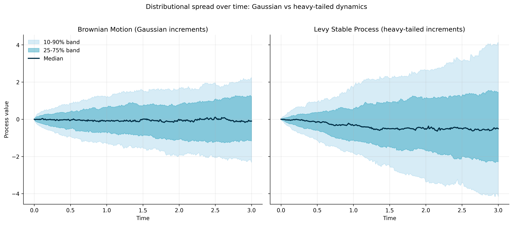
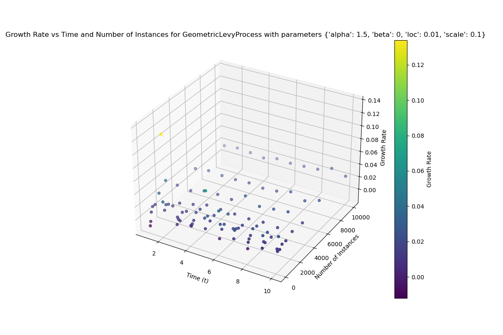
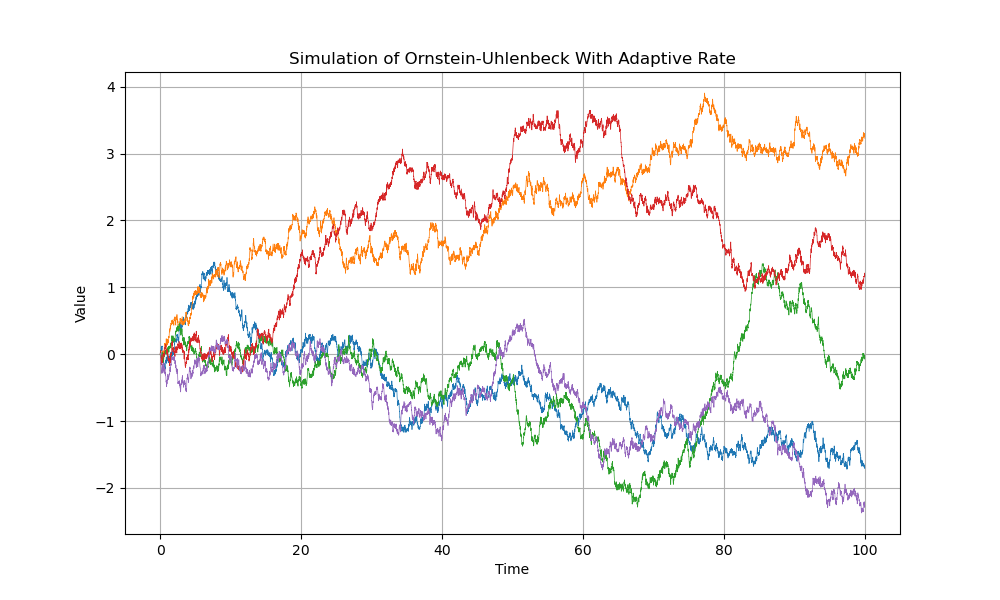
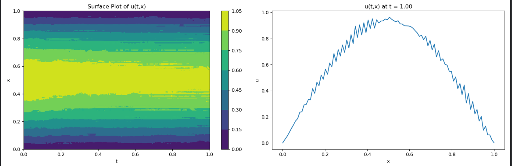

# Summary

`ergodicity_library` is an open-source Python package for research workflows centered on stochastic dynamics, especially settings where time-average behavior and ensemble-average behavior can diverge [@peters2016evaluating; @peters2019ergodicity]. The package integrates three layers that are often handled separately in ad hoc scripts: process simulation, diagnostics/analysis tools, and agent-based decision experiments.

In practice, many projects require repeated transitions between model definition, trajectory generation, fitting/diagnostic checks, and decision evaluation. The core contribution of this software is to make these transitions operationally coherent in one environment, reducing glue-code overhead and improving reproducibility [@kendiukhov2025repo; @kendiukhov2024book].

The package supports both baseline and advanced use-cases: Brownian and related processes, heavy-tailed families (including Lévy-stable variants), multiplicative growth settings, memory-dependent dynamics, and selected stochastic field simulations. This functionality is designed for researchers who need to compare assumptions quickly and inspect consequences with consistent interfaces.

# Statement of need

Research questions in quantitative finance, economics, physics-inspired modeling, and computational social science frequently involve nontrivial stochastic assumptions. Typical workflows are fragmented: one code path for simulation, another for diagnostics, another for fitting, and often a separate implementation for decision logic. This fragmentation increases implementation time and makes it harder to compare model variants under consistent conditions.

The specific need addressed by `ergodicity_library` is an integrated software framework for studies where process assumptions, transient diagnostics, and downstream decisions should be tested together. The intended users include applied researchers, graduate-level users, and research software practitioners who need to:

- simulate heterogeneous process families using a shared API,
- compare additive versus multiplicative dynamics,
- evaluate Gaussian versus heavy-tailed assumptions,
- inspect transient/preasymptotic behavior before asymptotic claims,
- couple stochastic dynamics to utility/portfolio/agent rules.

This package is not framed as a new mathematical theory. It is a research software contribution that operationalizes existing theory and methods into reusable computational workflows.

# State of the field

The scientific Python ecosystem provides high-quality numerical building blocks, notably NumPy, SciPy, SymPy, and Matplotlib [@harris2020numpy; @virtanen2020scipy; @meurer2017sympy; @hunter2007matplotlib]. These tools are foundational and intentionally general.

For stochastic simulation specifically, packages such as `stochastic`, `sdeint`, and `sdepy` provide useful focused capabilities [@stochastic_pkg; @sdeint_pkg; @sdepy_pkg]. They are valuable for generating paths or integrating SDEs, but generally do not aim to unify process abstraction, ergodicity-oriented diagnostics, fitting workflows, and agent-based experimentation under one research workflow model.

`ergodicity_library` was developed as a standalone package rather than a thin wrapper because its primary use-case depends on this cross-layer integration. The project targets a gap between low-level numerical primitives and narrowly scoped simulation utilities: comparative stochastic research where model choice, diagnostics, and decisions must be iterated jointly.

# Software design

The software is organized into three primary modules:

- **Processes**: Ito and non-Ito process classes, including heavy-tailed, multiplicative, and memory-dependent variants.
- **Tools**: symbolic/numerical helpers for fitting, diagnostics, preasymptotic analysis, automation, and selected partial stochastic differential equation experiments.
- **Agents**: utility-based decision logic, portfolio/pool experiments, and optimization-oriented workflows.

A central design choice is a common process abstraction that allows users to swap process families without rewriting surrounding diagnostics and experiment code. This improves comparability across assumptions and lowers the cost of model stress testing.

Figure-based examples below illustrate the workflow span.

### Heavy-tailed spread geometry

{ width=95% }

\autoref{fig:heavytail} shows why Gaussian assumptions can understate dispersion in heavy-tailed settings: quantile bands widen asymmetrically and nonlinearly.

### Multiplicative heavy-tailed growth diagnostics

{ width=90% }

\autoref{fig:geolevygrowth} demonstrates finite-sample variability of estimated growth rates under multiplicative heavy-tailed dynamics. This is directly relevant when practitioners compare expected outcomes to path-typical behavior.

### Memory-dependent process dynamics

{ width=90% }

\autoref{fig:adaptiveou} illustrates how adaptive-rate memory effects produce heterogeneous mean-reverting trajectories across realizations.

### Stochastic field simulation support

{ width=95% }

\autoref{fig:spde} shows that the package is not limited to scalar path simulation; it also supports stochastic field-style diagnostics in space-time settings.

The project is accompanied by a long-form book with worked examples and code context [@kendiukhov2024book]. At the same time, maturity constraints are explicit: selected API surfaces remain incomplete, automated pytest-style coverage is currently sparse relative to breadth, and optional ML-heavy agent paths can be environment-sensitive.

# Research impact statement

The current impact is primarily infrastructural and methodological. `ergodicity_library` reduces setup time for experiments that combine stochastic simulation, diagnostics, and decision logic in one workflow [@kendiukhov2025repo]. The package already enables reproducible demonstrations for heavy-tailed spread behavior, multiplicative growth diagnostics, adaptive-memory dynamics, and stochastic field visualization [@kendiukhov2024book].

At this stage, the strongest evidence is implemented breadth plus reproducible artifacts rather than large-scale adoption metrics. The software is publicly available under an OSI-approved license and can serve as a base for domain-specific extensions.

A realistic near-term impact path is improved reproducibility and faster iteration in cross-method stochastic studies, where users can move from hypothesis definition to comparative diagnostics without rebuilding experiment scaffolding repeatedly.

# AI usage disclosure

Generative AI assistance was used in preparing JOSS submission materials (manuscript drafting/editing, submission packaging, and figure-selection workflow scripting). The tools used were GPT-5-class coding assistants in an interactive development workflow.

All AI-assisted outputs were reviewed, edited, and validated by the human author. The author made the core scientific and software decisions and remains responsible for accuracy, originality, licensing compliance, and final submitted content.

# Acknowledgements

No external funding is declared for this submission. The author acknowledges the open scientific Python ecosystem that this project builds upon [@harris2020numpy; @virtanen2020scipy; @meurer2017sympy; @hunter2007matplotlib].

# References
